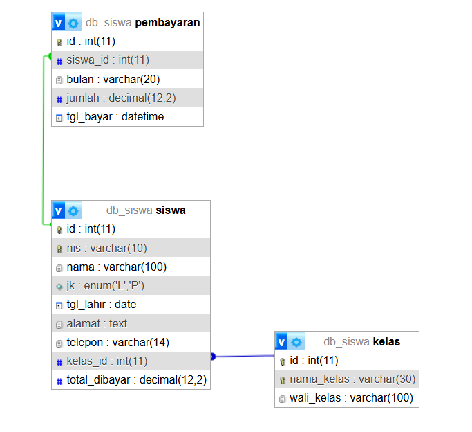

| Nama | WIRYA ATMAJA GUNAWAN |
| No. Absen | 14 |
| Kelas | XII RPL |
| Tema | Data Siswa |
| GitHub |  |


## Tujuan
Membuat aplikasi web untuk mengelola data siswa dan pembayaran SPP secara terpusat, sehingga data mudah dicari, akurat, dan mudah direkap.

## Fitur
- Daftar, tambah, detail, ubah, dan hapus data siswa
- Pencarian (nama/NIS) dan filter kelas
- Pencatatan pembayaran SPP (transaksi 2 tabel)
- Validasi input, pesan error, dan notifikasi berhasil/gagal
- Dashboard ringkasan: total siswa, siswa belum bayar, total pembayaran, rekap per kelas

## Teknologi
HTML, CSS, JavaScript (frontend); Node.js + Express (backend); MySQL (database); mysql2 (driver).

## Struktur Folder
```
backend/   server.js, config/db.js, package.json
frontend/  index.html, script.js, style.css
database/  database.sql
docs/      ERD.png, screenshots/
```

## Struktur Database


| Tabel | Kolom | Keterangan |
|---|---|---|
| kelas | id (PK), nama_kelas (UNIQUE), wali_kelas | Data kelas |
| siswa | id (PK), nis (UNIQUE), nama, jk, tgl_lahir, alamat, telepon, kelas_id (FK), total_dibayar | Tabel utama |
| pembayaran | id (PK), siswa_id (FK), bulan, jumlah, tgl_bayar | Riwayat pembayaran |

Relasi: kelas 1-N siswa; siswa 1-N pembayaran.

## Cara Menjalankan
1. Install Node.js dan XAMPP. Nyalakan **MySQL** di XAMPP.
2. Import database: phpMyAdmin → tab Import → pilih `database/database.sql`.
   Atau terminal: `Get-Content database\database.sql | mysql -u root`
3. Jalankan:
```
   cd backend
   npm install
   node server.js
```
4. Buka `http://localhost:3000`.

Jika MySQL memakai password, ubah di `backend/config/db.js`.

## Akun Uji
Aplikasi tidak memakai login, jadi tidak ada akun uji. Data contoh sudah tersedia (12 siswa, 3 kelas, 3 pembayaran).

## Jawaban Analisis Tertulis

**18. Masalah dan pengguna.** Pencatatan data siswa dan pembayaran SPP secara manual mudah salah, sulit dicari, dan sulit direkap. Pengguna aplikasi adalah admin/tata usaha sekolah.

**19. Tujuan utama.** Mengelola data siswa dan pembayaran SPP secara terpusat, akurat, dan mudah dicari.

**20. Data yang disimpan.** Kelas (nama kelas, wali kelas); siswa (NIS, nama, jenis kelamin, tanggal lahir, alamat, telepon, kelas, total dibayar); pembayaran (siswa, bulan, jumlah, tanggal bayar).

**21. Kebutuhan fungsional.**
1. Menampilkan daftar siswa beserta kelasnya.
2. Menambah data siswa baru.
3. Menampilkan detail siswa beserta riwayat pembayaran.
4. Mengubah data siswa.
5. Menghapus data siswa (ditolak jika punya riwayat pembayaran).
6. Mencari siswa berdasarkan nama/NIS dan memfilter berdasarkan kelas.
7. Mencatat pembayaran SPP dan otomatis menambah total dibayar siswa.
8. Menampilkan ringkasan: total siswa, belum bayar, total pembayaran, rekap per kelas.
9. Memvalidasi input dan menampilkan pesan error serta notifikasi.

**22. Alur utama.** Admin membuka aplikasi dan memilih menu, lalu mengisi form. Frontend mengirim data ke API backend dengan `fetch`. Backend memvalidasi data, lalu menyimpannya ke MySQL. Hasilnya dikembalikan sebagai JSON, dan frontend menampilkan notifikasi serta tabel terbaru.

**23. Alasan pemilihan tabel dan relasi.**
- `kelas` dipisah dari `siswa` agar data kelas dan wali kelas tidak diulang pada setiap siswa. Relasinya 1-N lewat FK `siswa.kelas_id`.
- `pembayaran` dipisah dari `siswa` karena satu siswa membayar berkali-kali setiap bulan. Relasinya 1-N lewat FK `pembayaran.siswa_id`, sehingga riwayat tersimpan lengkap.
- `siswa` adalah tabel utama yang menjadi pusat data.

**24. Uraian kode.**

*CRUD (hapus siswa, `DELETE /api/siswa/:id`).* Backend menjalankan `DELETE FROM siswa WHERE id=?`. Jika siswa punya pembayaran, MySQL menolak karena FK `ON DELETE RESTRICT`. Error `ER_ROW_IS_REFERENCED_2` ditangkap dan diubah menjadi pesan "Gagal hapus: siswa masih memiliki riwayat pembayaran".

*Transaksi (`POST /api/pembayaran`).* Urutannya `beginTransaction`, `INSERT INTO pembayaran`, `UPDATE siswa SET total_dibayar = total_dibayar + ?`, lalu `commit`. Jika salah satu langkah gagal, `rollback` membatalkan keduanya, sehingga pembayaran dan total siswa selalu sinkron.

*Validasi (fungsi `cek()` di `server.js`).* NIS harus 5-10 digit angka dan unik, nama wajib, jenis kelamin L/P, tanggal lahir valid dan tidak di masa depan, telepon diawali 08, dan kelas harus ada. Jika ada yang salah, server mengirim status 400 beserta pesan, yang ditampilkan di layar.

*Kendala dan perbaikan.* Lihat tabel di bawah.

**25. Penggunaan AI dan cara memastikan benar.** Lihat bagian "Penggunaan AI dan Referensi" di bawah.

## Pengujian (UNTUK BAGIAN PENGUJIAN TERSEDIA DI GOOGLE DRIVE)

| No | Skenario | Langkah | Hasil diharapkan | Hasil aktual | Status | Bukti |
|----|----------|---------|------------------|--------------|--------|-------|
| 1 | Tambah siswa valid | Data Siswa → Tambah → isi NIS 10013 dan data lengkap → Simpan | Data tersimpan, notifikasi hijau | [Data Tersimpan dengan baik dan nontifikasi hijau] | [Berhasil] | [Uji1](docs/screenshots/Uji1.png) |
| 2 | NIS tidak valid | Tambah siswa dengan NIS "abc" | Pesan error, data tidak tersimpan | [isi] | [Pesan Error "NISN wajib diisi dengan angka"] |  [Uji2](docs/screenshots/Uji2.png) |
| 3 | NIS duplikat | Tambah siswa dengan NIS 10001 | Pesan "NIS sudah terdaftar" | [Pesan Error "Nomor NISN berikut sudah terdaftar"] | [Berhasil] |  [Uji3](docs/screenshots/Uji3.png) |
| 4 | Pembayaran valid | Pembayaran → Budi, September 2026, 150000 | Berhasil, total dibayar bertambah | [Pesan berhasil "Pembayaran berhasil disimpan"] | [Berhasil] |  [Uji4](docs/screenshots/Uji4.png) [Uji4](docs/screenshots/Uji4b.png) |
| 5 | Pembayaran tidak valid | Jumlah -5000 | Pesan error, data tidak tersimpan | [Pesan Error "Jumlah harus angka lebih dari 0"] | [Berhasil] |  [Uji5](docs/screenshots/Uji5.png) |
| 6 | Hapus siswa punya pembayaran | Hapus Ahmad Fauzi | Ditolak dengan pesan error | [Pesan Error "Data siswa berikut memiliki riwayat"] | [Berhasil] | [Uji6](docs/screenshots/Uji6.png) |
| 7 | Pencarian | Cari "Citra" | Hanya Citra tampil | [Berhasil ditemukan dan hanya ada 1 Citra] | [Berhasil] | [Uji7](docs/screenshots/Uji7.png) |

## Kendala dan Perbaikan
| Kendala | Penyebab | Perbaikan |
| [kendala yang benar-benar kamu alami] | [penyebab] | [cara memperbaiki] |
| [kendala lain, jika ada] | | |

## Penggunaan AI dan Referensi
- Bagian yang dibantu AI: kerangka kode backend dan frontend, rancangan struktur tabel, draf dokumentasi.
- Referensi lain:.
